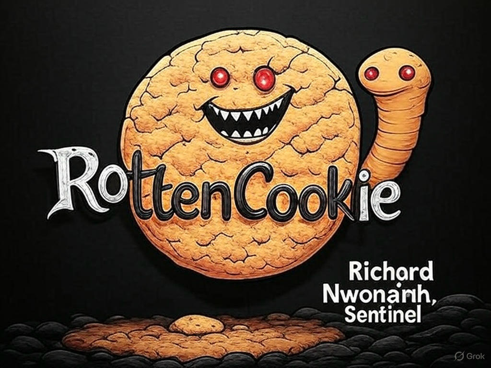

# 🍪 Generic .NET Cookie Serializer & Deserializer

A lightweight and **generic .NET console application** to serialize and deserialize cookies containing structured object data. It makes testing and debugging cookie values easy by handling JSON and URL encoding/decoding.

---

## ✨ Features

- ✅ Works with **any custom class** (generic).
- 🔐 Encodes values with **URL-safe encoding**.
- 💻 Command-line driven.
- 🧪 Perfect for **testing**, **debugging**, and **learning** cookie serialization concepts.
- 📦 Includes **Newtonsoft.Json** for powerful JSON handling.

---

## 🔧 Installation & Setup

1. **Clone the repository**:

```bash
git clone https://github.com/your-username/generic-cookie-serializer.git
cd generic-cookie-serializer
```
2. **Add the required dependency**:

```bash
dotnet add package Newtonsoft.Json
```
3. **Restore dependencies and build**:

```bash
dotnet restore
dotnet build
```

3. **Run the app**:

```bash
dotnet run
```
